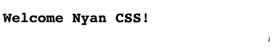

# 🌈 Nyan CSS

TODO CHECK THE GRAMMAR!

**Best of both worlds**. Nyan CSS lets you write plain CSS while riping
benifits of CSS-in-JS.

**Write universal design system**. You can reuse the same code anywhere starting
from static HTML+CSS and ending with React and Vue.js without actually
changing the CSS.

**Minimalistic**. BEM-inspired [Nyan CSS convention](#convention) consists
just of 3 rules but it as bulletproof as BEM.

**Use modern CSS**. CoffeeScript has gone from the radars yet we all loved it.
Stick to the platform to ensure the longevity of your code.

**[Skip to the convention](#convention)** | **[Join the community](https://spectrum.chat/nyancss)**

## Installation

See [installation instructions for webpack](https://github.com/nyancss/nyancss-css-modules-loader#installation).

## Demo

### CSS

```css
.Header,
.Text {
  font-family: monospace;
}

.Header {
  font-size: 2rem;
}

.Header-size-large {
  font-size: 2.2rem;
}

.Text-italic {
  font-style: italic;
}
```

### React code

See other options:

- [Plain HTML](#plain-html)
- [Vue.js](#vuejs)
- [Preact](#preact)
- [Class names](#class-names)

```jsx
import React from 'react'
import { Header, Text } from './style.css'

function Announcement() {
  return (
    <>
      <Header tag="h1" size="large">
        Welcome Nyan CSS!
      </Header>
      <Text tag="marquee" italic>
        Please, welcome Nyan CSS!
      </Text>
    </>
  )
}
```

### Result



### Other options

<details><summary>Show all options</summary>
<p>

#### Plain HTML

```html
<h1 class="Header Header-size-large">
  Welcome Nyan CSS!
</h1>

<marquee class="Text Text-italic">
  Please, welcome Nyan CSS!
</marquee>
```

#### Vue.js

```js
import Vue from 'vue'
import { Header, Text } from './style.css'

const Announcement = {
  components: {
    'custom-header': Header,
    'custom-text': Text
  },

  template: `
    <main>
      <custom-header tag='h1' size='large'>Welcome Nyan CSS!!</custom-header>
      <custom-text tag='marquee' italic='true'>Please, welcome Nyan CSS!</custom-text>
    </main>
  `
}
```

#### Preact

```jsx
import { h } from 'preact'
import { Header, Text } from './style.css'

function Announcement() {
  return (
    <>
      <Header tag="h1" size="large">
        Welcome Nyan CSS!
      </Header>
      <Text tag="marquee" italic>
        Please, welcome Nyan CSS!
      </Text>
    </>
  )
}
```

#### Class names

```js
import { Header, Text } from './style.css'

function Announcement() {
  return `
<h1 class='${Header({ size: 'large' })}'>Welcome Nyan CSS!</h1>
<marquee class='${Text({
    italic: true
  })}'>Please, welcome Nyan CSS!</marquee>
`
}
```

</p>
</details>

## Convention

### Component

`.Component` is a component class.

_The name must be in ClassCase, e.g. `.FormInput` ror `.UI`._

In this example, `.Button` represents `<Button />`.

```css
.Button {
  color: white;
}
```

### Boolean prop

`.Component-disabled` is a boolean prop class.

_The name extension must be in camelCase, e.g. `.FormInput-autoFocus` or `.UI-dev`._

```css
.Button-disabled {
  opacity: 0.5;
}
```

In the example, `.Button-disabled` is applied to the component when its `disabled` prop is truthy:

```javascript
<Button tag="button" disabled>
  Whatever
</Button>
```

### Enum prop

`.ComponentName-color-gray` is an enum prop class.

_The name extensions must be in camelCase, e.g. `.FormInput-borderColor-lightGray` or `.UI-env-dev`._

```css
.Button-color-red {
  background: red;
}

.Button-color-green {
  background: green;
}
```

`.Button-color-red` is applied to the component when its `color` prop equals `"red"`:

```jsx
<Button tag="button" color="red">
  Click Me
</Button>
```

## Related packages

- [@nyancss/css-modules](https://github.com/nyancss/nyancss-css-modules-loader) - the webpack loader for CSS Modules.
- [@nyancss/css-modules](https://github.com/nyancss/nyancss-css-modules) - the package used to convert CSS Modules to Nyan CSS.
- [@nyancss/react](https://github.com/nyancss/nyancss-react) - the package used to convert Nyan CSS to React/Preact components.
- [@nyancss/vue](https://github.com/nyancss/nyancss-vue) - the package used to convert Nyan CSS to Vue.js components.
- [@nyancss/class-names](https://github.com/nyancss/nyancss-class-names) - the package used to convert Nyan CSS to class names functions.

## Changelog

See [the changelog](./CHANGELOG.md).

## License

[MIT © Sasha Koss](https://kossnocorp.mit-license.org/)
